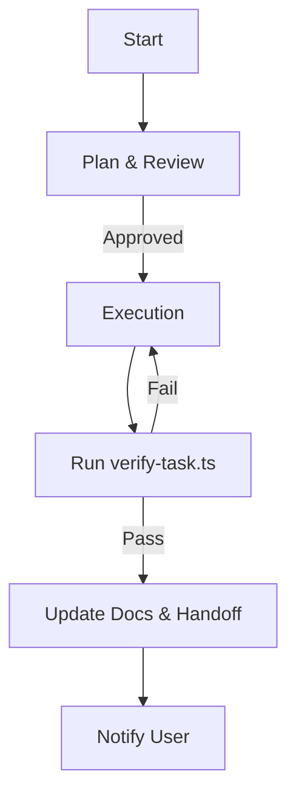

# Agent Workflow Overview

This document outlines the standard lifecycle of a task, ensuring strict adherence to project governance.

## 1. Planning Phase 🧠
**Trigger**: User request or next item in `task.md`.
1.  **Initialize**: Run `bun run start-task "Task Name"`.
    *   Creates feature branch.
    *   Creates Implementation Plan template.
2.  **Plan**: Fill out the created plan logic.
3.  **Review**: Call `notify_user` to get approval.

## 2. Execution Phase ⚡️
**Trigger**: User approval.
1.  **Task Management**: Work on the feature branch.
2.  **Implementation**: TDD -> Code -> Refactor.

## 3. Governance & Completion 🏁
**Trigger**: Implementation complete.
1.  **Finish**: Run `bun run finish-task`.
    *   Runs `verify-task` (Lint, Type, Test, Smoke).
    *   Checks Documentation updates.
    *   Provides Git Commit instructions.
2.  **Handoff**:
    *   Update `manifest.md` / `task.md`.
    *   Run `/handoff` workflow.
3.  **Commit**: Follow instructions from `finish-task`.
4.  **Push & PR**:
    *   Push feature branch: `git push origin feature/name`.
    *   Create Pull Request (or merge if solo).

## 5. Continuous Improvement 🚀
**Trigger**: End of Session.
1.  **Audit**: Review `retrospective.md`.
2.  **Upgrade**: Implement new guardrails (e.g., new lint rules, new scripts) based on lessons learned.

## Summary Visual

