# Application Visual Reference

Comprehensive visual documentation of the Restock application structure, architecture, and user interface.

## 📂 Project Structure
- [**File Tree**](./file-structure.tree): Complete textual directory map.
- [**Tech Stack**](./tech-stack.md): Frameworks, libraries, and tools.
- [**Architecture**](./architecture.md): System, Component, and Database diagrams.

## 📸 UI Gallery
**Test User:** `visualizer_test` / `Password123!`

| View | Desktop (1440x900) | Mobile (375x812) |
|------|-------------------|------------------|
| **Landing** | 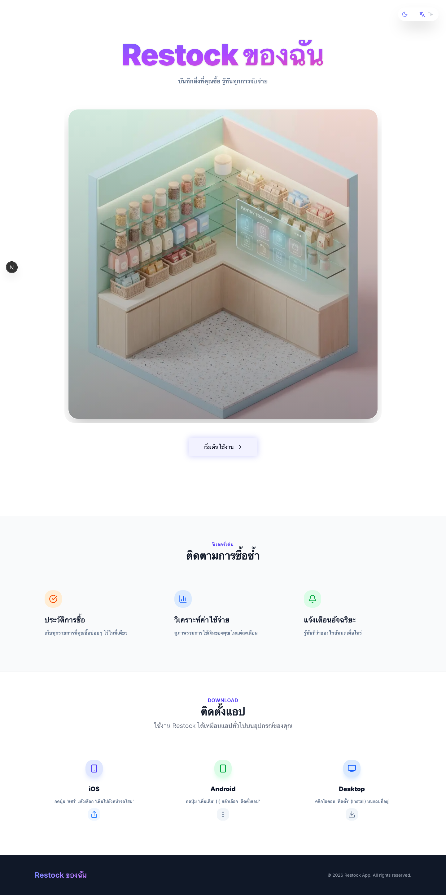 | 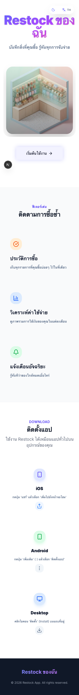 |
| **Login** | 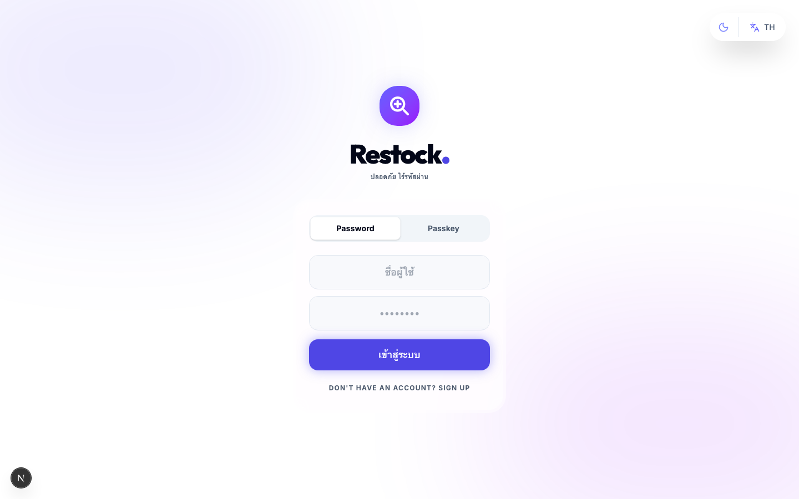 |  |
| **Dashboard** | 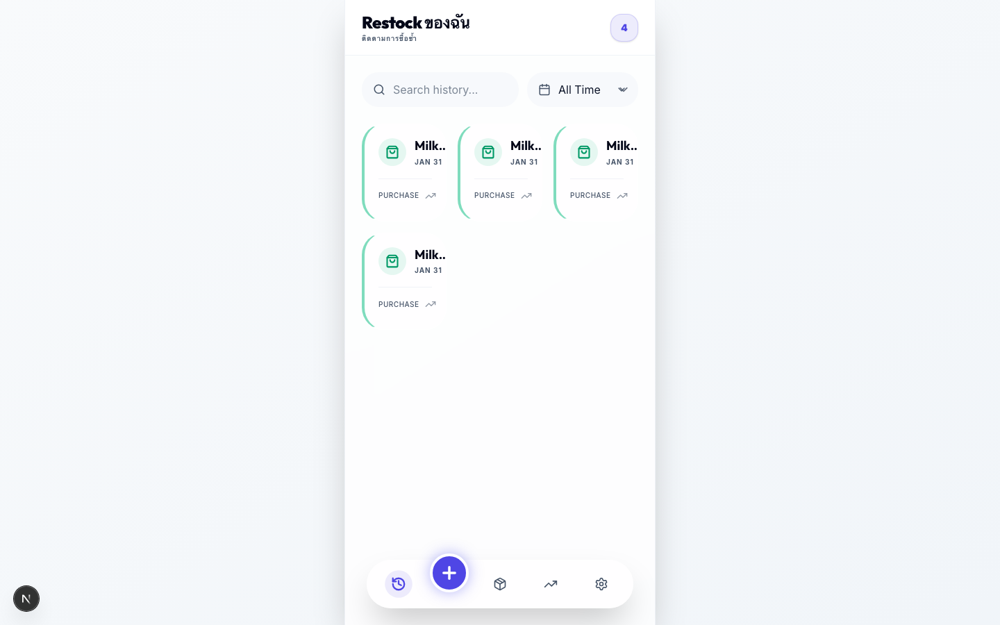 | 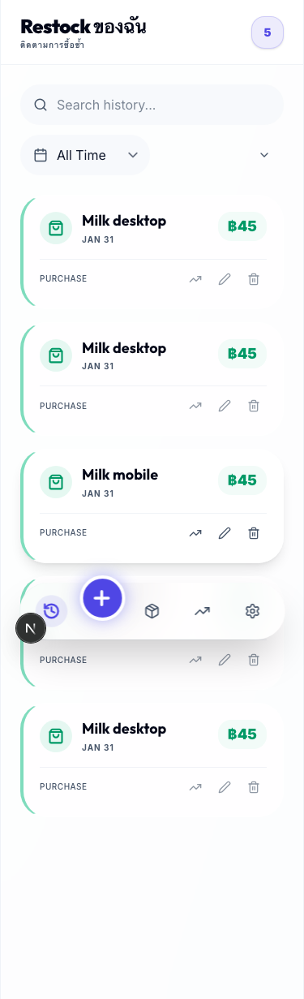 |
| **Add Entry** | 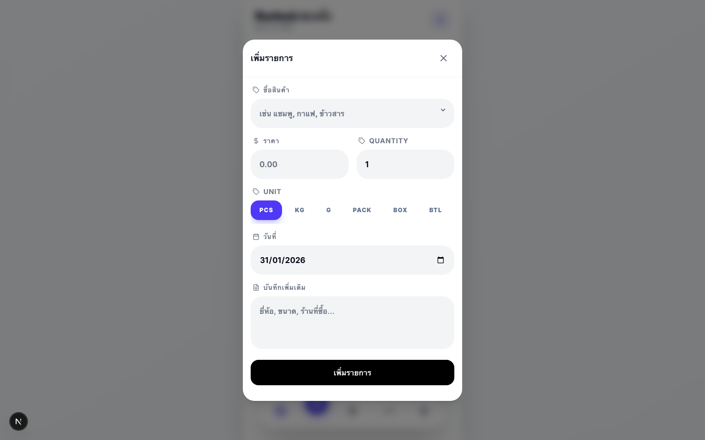 | 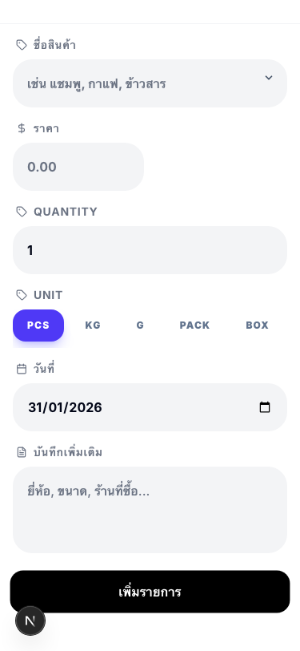 |
| **Inventory** | 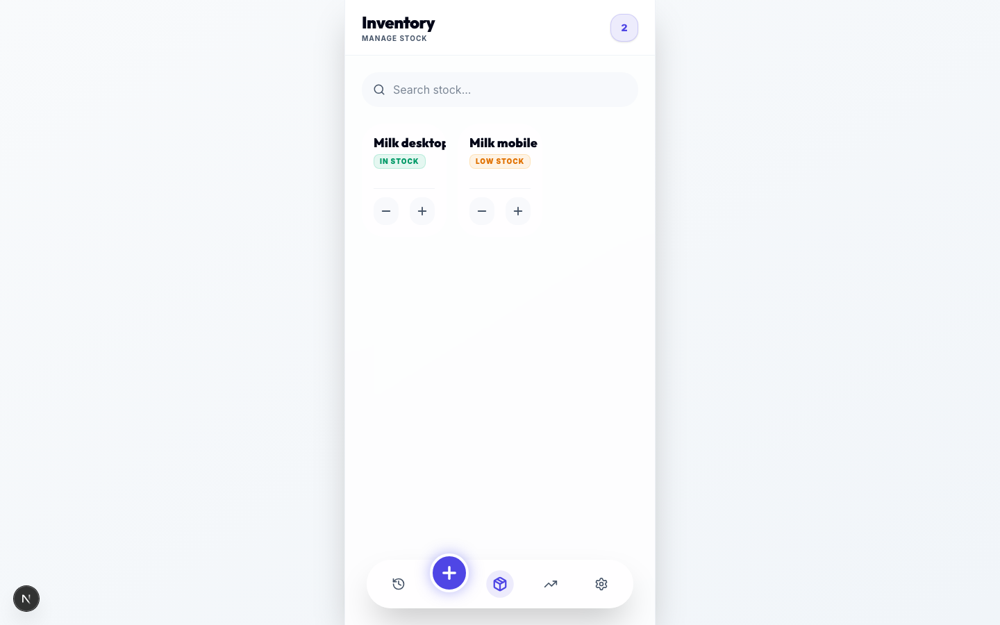 | 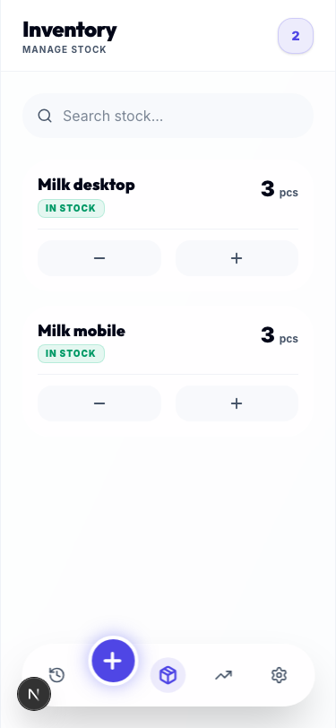 |
| **Settings** | 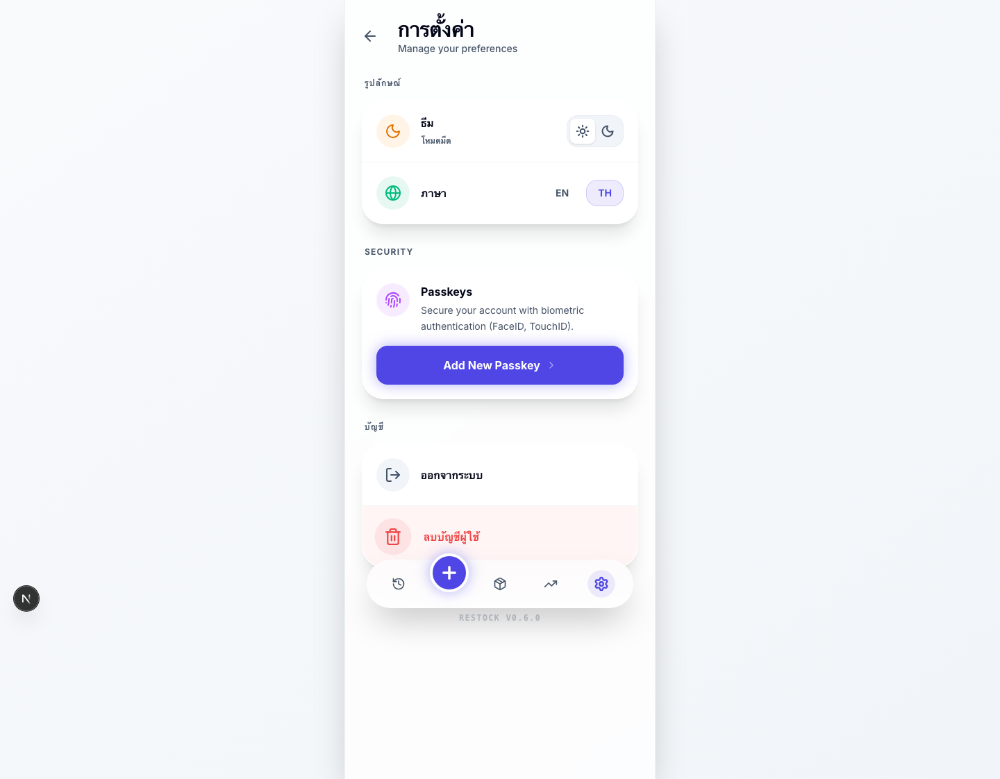 | 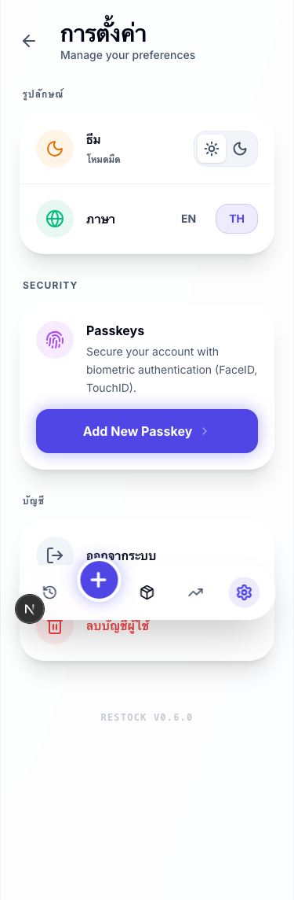 |

> **Note:** Screenshots are auto-generated via Playwright.
