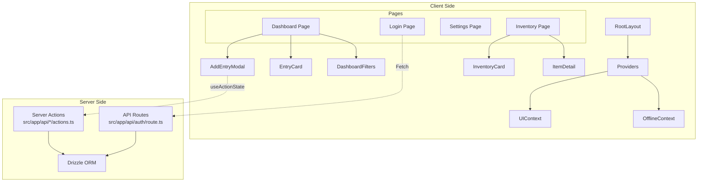
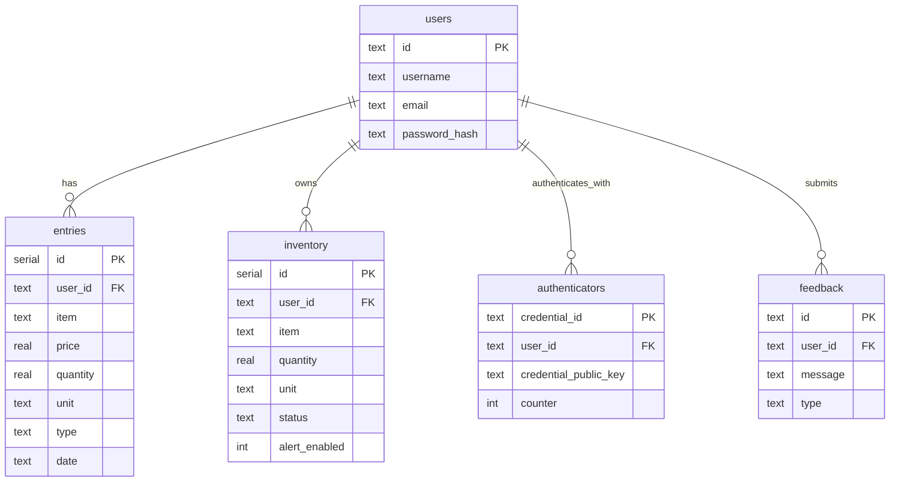

# Application Architecture

## System Context

```mermaid
graph TD
    User((User))
    PWA[Next.js PWA\n(Browser/Mobile)]
    API[Next.js API Routes\n/api/*]
    ServerActions[Server Actions\n(Data Mutation)]
    DB[(PostgreSQL)]
    IDB[(IndexedDB\nLocal Storage)]

    User -->|Interacts| PWA
    PWA -->|Read/Write (Offline)| IDB
    PWA -->|Sync (Online)| ServerActions
    PWA -->|Auth| API
    ServerActions -->|Query/Mutation| DB
    API -->|Auth Verification| DB
```

## Component Architecture



## Database Schema


